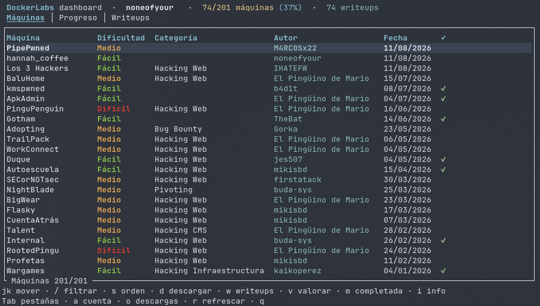
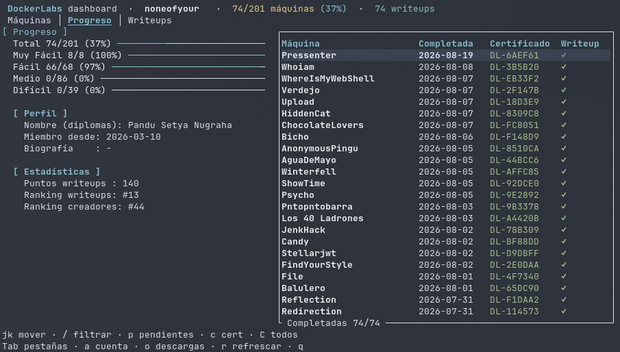

# dl-tui

### Dashboard no oficial de DockerLabs — unofficial DockerLabs terminal dashboard

<p align="center">
  
</p>

**dl-tui** is an interactive terminal dashboard for [DockerLabs](https://dockerlabs.es): browse the machine catalog, download machines, read and submit community writeups, rate machines, track your progress and download your completion certificates — all without leaving the terminal.

One command, one screen: running `dl` opens the dashboard. Written in pure **Rust** (ratatui), shipped as a single static binary. The UI is in **Spanish**, staying true to the original platform, with a **Nord** theme.

> **Login required**: the dashboard starts with an in-app login popup (your password lives in the OS vault — never in plain text), because most of the platform's features are account-bound: progress, completed machines, ratings, writeup submissions and certificates.

---

## Screenshots

| Máquinas | Progreso |
| :---: | :---: |
|  |  |

Color-coded difficulties with the site's own palette, live progress gauges, per-machine certificate ids, and a pending-writeup view so you always know what is left to do.

---

## Features

* **One command** — `dl` opens the dashboard: catalog, downloads, writeups, ratings and your progress in one screen.
* **Máquinas** — the full catalog (name, difficulty with the official colors, category, author, date, description) with instant `/` filtering and `s` sorting (site order → nombre → fecha → dificultad).
* **High-speed downloads** — machines stream directly from DockerLabs' public storage: up to **2 in parallel** (extras queue), live gauges in the Descargas overlay, `.part` staging so partial files never look complete, `c` cancels. Existing files are skipped automatically.
* **Path completion** — the download destination supports zsh-style `Tab` completion: expand `~`, list the directories, complete the common prefix.
* **Writeups** — per-machine community writeups popup (`w`): articles 📝 and videos 🎥, `Enter` opens them in the browser, `u` submits your own. Plus a dedicated **Writeups** tab listing every writeup you have published.
* **Valoraciones** — per-machine rating averages across 4 criteria (`v`), plus submitting your own scores (1–5) and seeing what you rated.
* **Progreso** — completion gauges per difficulty, statistics (points, rankings), your profile (diploma name, member since, biography), the list of completed machines with their certificate ids, and a pending-writeup view (`p`).
* **Certificates** — download the admin-issued certificate PDF (`c`) or all of them at once (`C`) into `certificados/`. The dashboard tells you the exact missing step when a certificate has not been issued yet.
* **Account management in-app** (`a`) — switch account or logout; running downloads are never affected.
* **Secure Auth** — the password lives in your OS vault (Secret Service on Linux, Credential Manager on Windows, Keychain on macOS) via `keyring`. Only the username and the last download folder touch `~/.dl-tui/config.json`.

---

## Prerequisites

* **OS**: Linux (primary target — **developed and tested on Arch Linux**), macOS and Windows release binaries are provided.
* A [DockerLabs](https://dockerlabs.es) account.
* A Secret Service provider on Linux (e.g. `sudo pacman -S gnome-keyring`) for credential storage.

---

## Installation

### 1. From a release binary (easiest)

Grab the archive for your platform from the [Releases](https://github.com/setyanoegraha/dl-tui/releases) page:

| Platform | Archive |
| :--- | :--- |
| Linux x86_64 | `dl-v0.1.2-x86_64-unknown-linux-gnu.tar.gz` |
| macOS Apple Silicon | `dl-v0.1.2-aarch64-apple-darwin.tar.gz` |
| macOS Intel | `dl-v0.1.2-x86_64-apple-darwin.tar.gz` |
| Windows x86_64 | `dl-v0.1.2-x86_64-pc-windows-msvc.zip` |

```bash
tar xzf dl-v0.1.2-x86_64-unknown-linux-gnu.tar.gz
install -m 755 dl ~/.local/bin/dl
```

> **Arch Linux** — dl-tui is developed and tested on Arch. The Linux release binary is built on Ubuntu, but runs on Arch out of the box; just make sure a Secret Service provider is installed:
>
> ```bash
> sudo pacman -S --needed gnome-keyring
> ```

### 2. From source

```bash
git clone https://github.com/setyanoegraha/dl-tui.git
cd dl-tui
cargo install --path .
```

### 3. From git directly

```bash
cargo install --git https://github.com/setyanoegraha/dl-tui.git
```

> Requires the Rust toolchain (1.85+): https://rustup.rs

---

## First Setup

Nothing to configure by hand — just run:

```bash
dl
```

On the very first run (or when the stored password no longer works) the dashboard opens a **Configurar DockerLabs** popup:

1. Type your DockerLabs **username**, then press `Tab` / `↓`.
2. Type your **password** (hidden as `•••`), then press `Enter`.

Credentials are validated with a real login **before** anything is saved. If the login fails, the popup reopens with your username kept; `Esc` quits the app.

---

## Usage Guide

Three keyboard-driven tabs — **Máquinas**, **Progreso** and **Writeups**:

| Keys | Action |
| :--- | :--- |
| `Tab` / `←` `→` | Switch tabs |
| `↑` `↓` / `j` `k` | Move selection |
| `g` / `Home` | Jump to the top of the list |
| `/` | Filter the current list (type to narrow, `Enter` keeps it, `Esc` clears & exits) |
| `s` | **Máquinas** — cycle sort: site order → nombre → fecha → dificultad |
| `d` | **Máquinas** — download popup: pick the destination folder (remembered across sessions, `Tab` completes the path), live progress in the Descargas overlay |
| `w` | **Máquinas** — community writeups popup: `j`/`k` select, `Enter` opens the link, `u` submits your own writeup |
| `v` | **Máquinas** — rating averages popup; `Enter` opens the form to send your 4 scores (1–5). After rating, `Tu valoración: n/n/n/n` shows your own scores |
| `m` | **Máquinas** — toggle the machine as completed (the platform's solved mechanic) |
| `i` / `Enter` | **Máquinas** — description popup with the full machine details |
| `c` | **Máquinas & Progreso** — download the selected machine's certificate PDF into `certificados/` and open it. If it hasn't been issued yet, the popup tells you the exact missing step (publish writeup `w` → mark completed `m` → wait for admin validation) |
| `C` | **Progreso** — batch-download every issued certificate into `certificados/` |
| `p` | **Progreso** — show only completed machines whose writeup is still pending |
| `a` | Account popup: `Enter` switch account, `l` logout |
| `o` | Toggle the Descargas overlay (downloads keep running when closed) |
| `c` | In the Descargas overlay — cancel the most recent active download |
| `Enter` | **Máquinas** — description popup · **Progreso** — open the linked writeup · **Writeups** — open your writeup |
| `r` | Re-fetch all data |
| `q` / `Esc` / `Ctrl-C` | Quit (with active downloads, the first `q` lists them — press again to abort) |

Result popups stay until dismissed (`✓ ENVIADO`, `✗ REJECTED`, ...) and trigger a data refresh on close when your progress changed.

### Downloads

Machines stream directly from DockerLabs' public storage — no MEGA, no decryption, no account needed for the files themselves. Pick the destination in the popup (zsh-style `Tab` completion included), watch live gauges in the Descargas overlay (`o`), cancel with `c`. Partial downloads live in a `.part` staging file, so a failed or cancelled attempt never leaves a broken zip behind. Downloading a machine you already have simply skips it.

### Certificates

Certificates are **issued manually by the DockerLabs admins** — they appear once your writeup is validated and the machine is marked completed. `c`/`C` download the issued PDFs into `certificados/` inside your download folder and open them; when a certificate hasn't been issued yet, the dashboard tells you the exact missing step instead of a raw error.

### Account Management

Press `a` anywhere in the dashboard:

- **`Enter` — switch account**: opens the login popup with the current username prefilled. New credentials are validated by a real login before replacing the stored account, and the dashboard reloads with the new profile.
- **`l` — logout**: removes the password from the system vault and the username from `~/.dl-tui/config.json` (your download-folder preference is kept), clears the dashboard and shows the login popup.
- Running downloads are never affected — they use public links, not your session.

### Where Your Data Lives

- `~/.dl-tui/config.json` — only two things: your **username** and the **last download folder**.
- The download folder is managed **from the dashboard**: whatever you confirm in the download popup (`d`) is saved automatically — no manual editing required. Certificates go into a `certificados/` subfolder of it.
- System vault — your password, under the `dl-tui` service. Never on disk in plain text.

---

## Updating

```bash
cargo install --git https://github.com/setyanoegraha/dl-tui.git --force
```

or grab the latest release binary from the [Releases](https://github.com/setyanoegraha/dl-tui/releases) page.

### Uninstallation & Cleanup

```bash
cargo uninstall dl
```

Delete `~/.dl-tui/` (and the `dl-tui` vault entry) to clear all local data.

---

## Disclaimer

dl-tui is an **unofficial** community tool and is not affiliated with DockerLabs. It only uses the platform's documented public API plus the same pages the web app uses, at human speed — be kind to the service.

---

## Acknowledgements

Thanks to [El Pingüino de Mario](https://github.com/Maalfer) and the DockerLabs community for the platform, and to the [ratatui](https://github.com/ratatui/ratatui) team for the toolkit.

Sibling project: [hmv-tui](https://github.com/setyanoegraha/hmv-tui) — the same dashboard concept for HackMyVM.

---

Made with ❤️ by [Ouba](https://github.com/setyanoegraha).

*¡Feliz hacking en DockerLabs!*
